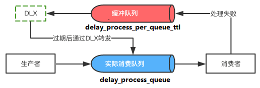
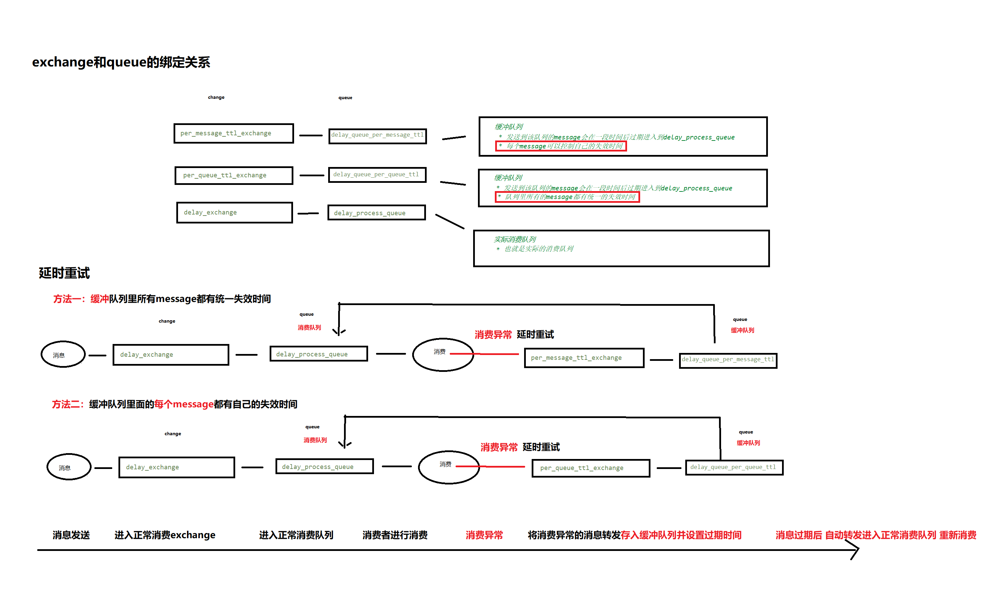

## 背景

何为延迟队列？

顾名思义，延迟队列就是进入该队列的消息会被延迟消费的队列。而一般的队列，消息一旦入队了之后就会被消费者马上消费。

场景一：在订单系统中，一个用户下单之后通常有30分钟的时间进行支付，如果30分钟之内没有支付成功，那么这个订单将进行一场处理。这是就可以使用延时队列将订单信息发送到延时队列。

场景二：用户希望通过手机远程遥控家里的智能设备在指定的时间进行工作。这时候就可以将用户指令发送到延时队列，当指令设定的时间到了再将指令推送到只能设备。

## 延迟队列能做什么？

延迟队列多用于需要延迟工作的场景。最常见的是以下两种场景：

1、**延迟消费**。比如：

1. 用户生成订单之后，需要过一段时间校验订单的支付状态，如果订单仍未支付则需要及时地关闭订单。
2. 用户注册成功之后，需要过一段时间比如一周后校验用户的使用情况，如果发现用户活跃度较低，则发送邮件或者短信来提醒用户使用。

2、**延迟重试**。比如消费者从队列里消费消息时失败了，但是想要延迟一段时间后自动重试。

如果不使用延迟队列，那么我们只能通过一个轮询扫描程序去完成。这种方案既不优雅，也不方便做成统一的服务便于开发人员使用。但是使用延迟队列的话，我们就可以轻而易举地完成。

## 如何实现？

别急，在下文中，我们将详细介绍如何利用Spring Boot加RabbitMQ来实现**延迟重试**队列。

## 实现思路

在介绍具体的实现思路之前，我们先来介绍一下RabbitMQ的两个特性，一个是Time-To-Live Extensions，另一个是Dead Letter Exchanges。

**Time-To-Live Extensions**

RabbitMQ允许我们为消息或者队列设置TTL（time to live），也就是过期时间。TTL表明了一条消息可在队列中存活的最大时间，单位为毫秒。也就是说，当某条消息被设置了TTL或者当某条消息进入了设置了TTL的队列时，这条消息会在经过TTL秒后“死亡”，成为Dead Letter。如果既配置了消息的TTL，又配置了队列的TTL，那么较小的那个值会被取用。更多资料请查阅官方文档。

**Dead Letter Exchange**

刚才提到了，被设置了TTL的消息在过期后会成为Dead Letter。其实在RabbitMQ中，一共有三种消息的“死亡”形式：

1. 消息被拒绝。通过调用basic.reject或者basic.nack并且设置的requeue参数为false。
2. 消息因为设置了TTL而过期。
3. 消息进入了一条已经达到最大长度的队列。

如果队列设置了Dead Letter Exchange（DLX），那么这些Dead Letter就会被重新publish到Dead Letter Exchange，通过Dead Letter Exchange路由到其他队列。更多资料请查阅官方文档。

## 流程图

聪明的你肯定已经想到了，如何将RabbitMQ的TTL和DLX特性结合在一起，实现一个延迟队列。

#### **延迟重试**

延迟消费是延迟队列最为常用的使用模式。如下图所示，生产者产生的消息首先会进入缓冲队列（图中红色队列）。通过RabbitMQ提供的TTL扩展，这些消息会被设置过期时间，也就是延迟消费的时间。等消息过期之后，这些消息会通过配置好的DLX转发到实际消费队列（图中蓝色队列），以此达到延迟消费的效果。
 

## 代码实现流程

- 创建queue、exchange、绑定路由规则、监听器 -- QueueConfig.java
- 设置队列消息的过期时间（只针对方法二需要该文件） -- ExpirationMessagePostProcessor.java
- 发送消息到exchange -- ApplicationTests.java下的testFailMessage()方法
- 从exchange接收消息 -- ProcessReceiver.java

**具体代码请参考：[https://github.com/LiJinHongPassion/springboot/tree/master/springboot_rabbitmq_demo/rabbitmq-demo（延时队列）/延时重试](https://github.com/LiJinHongPassion/springboot/tree/master/springboot_rabbitmq_demo/rabbitmq-demo（延时队列）/延时重试) **

方法一： [springboot-rabbitmq-delay-message](https://github.com/LiJinHongPassion/springboot/tree/master/springboot_rabbitmq_demo/rabbitmq-demo（延时队列）/延时重试/springboot-rabbitmq-delay-message) 

方法二： [springboot-rabbitmq-delay-queue](https://github.com/LiJinHongPassion/springboot/tree/master/springboot_rabbitmq_demo/rabbitmq-demo（延时队列）/延时重试/springboot-rabbitmq-delay-queue) 

## **查看测试结果**

**延迟重试场景**

接下来，我们再来看一下延迟重试的测试结果：

 

ProcessReceiver首先收到了3条会触发FAIL的消息，然后将其移动到缓冲队列之后，过了4秒，又收到了刚才的那3条消息。延迟重试场景测试成功。

## 参考

 https://www.jb51.net/article/128702.htm 	Spring Boot与RabbitMQ结合实现延迟队列的示例

